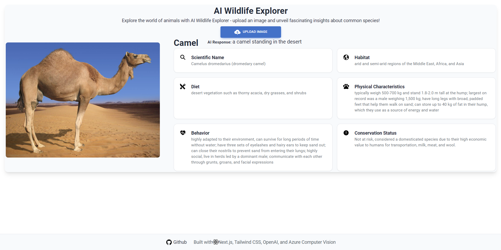

# Animal Scan Next

Animal Scan Next is a web application that allows users to upload an image of an animal and receive information about the animal in the image. The app uses Azure Computer Vision API to identify the animal and OpenAI API to fetch relevant information.

## Table of Contents

- [Features](#features)
- [Demo](#demo)
- [Usage](#usage)
- [Technologies](#technologies)
- [Installation](#installation)
- [Support](#support)
- [Roadmap](#roadmap)
- [Acknowledgements](#acknowledgements)
- [Contact](#contact)

## Features

- Identify animals in images using Azure Computer Vision API
- Fetch relevant information about the identified animal using OpenAI API
- Display structured information, including scientific name, habitat, diet, physical characteristics, behavior, and conservation status
- Responsive design for mobile and desktop users
- Built with Next.js 13 and Tailwind CSS

## Demo

A live demo of the app is available at [https://nates-animal-scanner.netlify.app/](https://nates-animal-scanner.netlify.app/).

## Usage

To use the app, follow these steps:

1. Visit the Animal Scan Next homepage.
2. Click the "Upload Image" button and select an image of an animal from your device.
3. Wait for the image to be processed and analyzed.
4. The app will display the name of the animal, an AI-generated caption, and structured information about the animal.

## Technologies

This project is built using the following technologies:

- Next.js 13
- Tailwind CSS
- Azure Computer Vision API
- OpenAI API
- React
- React Ionicons

## Installation

Follow these steps to install the Animal Scan Next app on your local machine:

1. Clone the repository: `git clone https://github.com/natejahnke/animal-scan-next.git`
2. Change to the project directory: `cd animal-scan-next`
3. Install dependencies: `npm install` or `yarn install`
4. Create a `.env` file in the root directory and add your Azure Computer Vision API key and OpenAI API key:
        NEXT_PUBLIC_SUBSCRIPTION_KEY=<your Azure Computer Vision API key>
        NEXT_PUBLIC_ENDPOINT=<your Azure Computer Vision API endpoint>
        OPENAI_API_KEY=<your OpenAI API key>
5. Start the development server: `npm run dev` or `yarn dev`
6. Open [http://localhost:3000](http://localhost:3000) in your browser to view the app.

## Support

If you encounter any issues or have questions about the app, please open an issue on the [GitHub repository](https://github.com/natejahnke/animal-scan-next/issues).

## Roadmap

Future improvements and features planned for Animal Scan Next include:

- Enhance user interface and user experience
----

## Acknowledgements

- [Azure Computer Vision API](https://learn.microsoft.com/en-us/azure/cognitive-services/computer-vision/overview)
- [OpenAI API](https://beta.openai.com/docs/)
- [React](https://reactjs.org/)
- [Next.js](https://nextjs.org/)
- [Tailwind CSS](https://tailwindcss.com/)

## Contact

Nate Jahnke - [GitHub](https://github.com/natejahnke)

Project Repository: [https://github.com/natejahnke/animal-scan-next](https://github.com/natejahnke/animal-scan-next)

